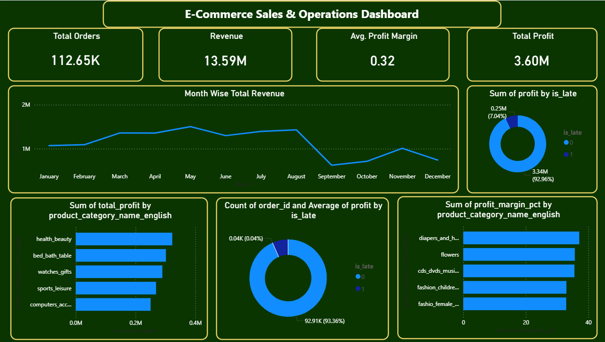

# 🛒 Ecommerce-sales-profitability-analysis

## 📌 Project Overview
This project is an end-to-end Business Intelligence solution built on the Olist E-commerce dataset. It focuses on analyzing sales, customer behavior, and delivery performance to generate actionable business insights.
The project simulates a real-world data analytics workflow using Python, SQL, and Power BI.

---

## 🎯 Problem Statement
E-commerce platforms generate large amounts of data, but lack clear visibility into sales performance, customer behavior, and delivery efficiency. This makes it difficult for businesses to identify trends, monitor operations, and make data-driven decisions.
This project addresses these challenges by analyzing e-commerce data and building dashboards to provide actionable business insights.

---

## 🎯 Objectives
1. Analyze sales performance and revenue trends
2. Understand customer purchasing behavior
3. Evaluate delivery performance and operational efficiency
4. Build interactive dashboards for business stakeholders
5. Support data-driven decision-making

---

## 🛠️ Tools & Technologies
🔹 Data Processing
 - Python (Pandas, NumPy)
🔹 Database
 - MYSQL
🔹 Analytics
 - MYSQL (Joins, Aggregations, KPI calculations)
🔹 Visualization
 - Power BI

---

## 📊 Key Features
## 📈 Sales Analysis - 
- Revenue trends over time
- Top-performing product categories
- Best-selling products  

## 🚚 Operations Analysis - 
- Average delivery time
- Late delivery percentage
- City-wise delivery performance

---

## 🖼 Architecture

Raw Data → Python ETL → SQL Database → Power BI Dashboard

## Dashboard

